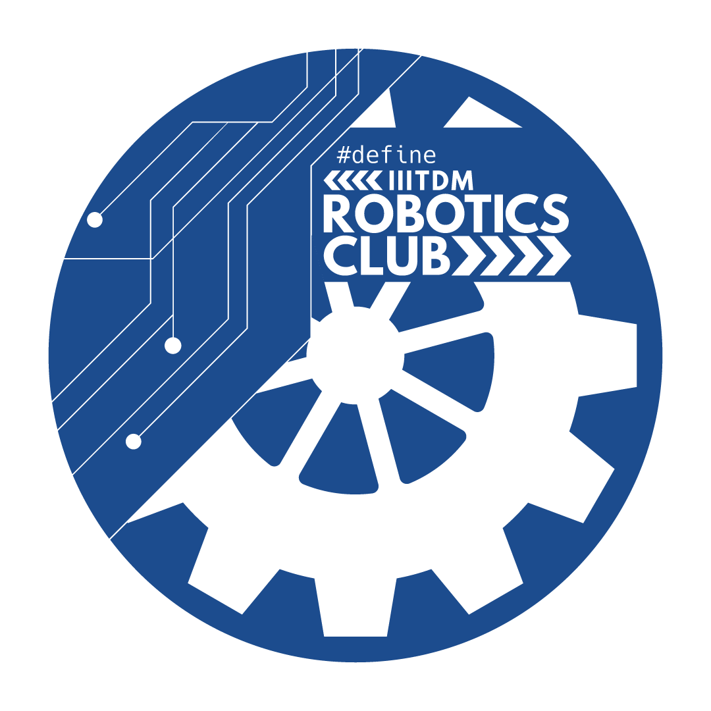

### Robotics Club, IIITDM Kancheepuram

#### Who are we?
We are the Robotics Club of the [Indian Institute of Information Technology, Design and Manufacturing, Kancheepuram](https://www.iiitdm.ac.in).

#### Our vision
Being the one-stop club that helps students and other technical clubs with the WHYs, WHATs, and HOWs of robotics at IIITDM Kancheepuram.

#### Out Mission
- To **inspire** students towards robotics.
- To **introduce** the foundational concepts of robotics.
- To **initiate** training about the relevant tools.

<!--  --> 
